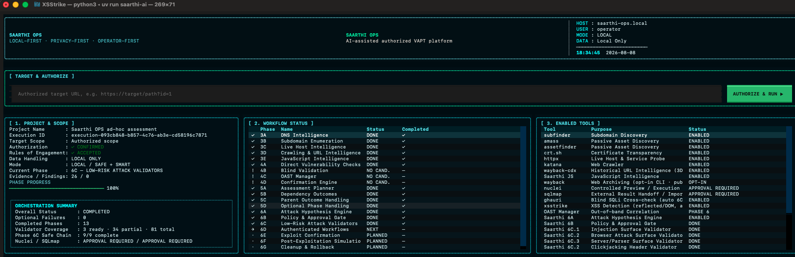
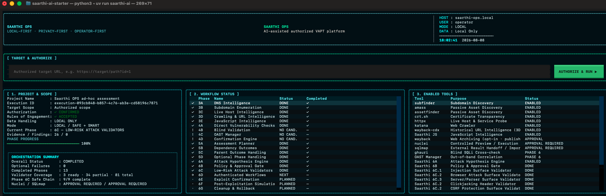

# Saarthi OPS

**A local-first, privacy-first, AI-assisted VAPT platform.**
Reconnaissance through controlled attack validation, driven by a local-LLM
co-pilot — entirely on the operator's own machine. No target data, credentials,
or evidence ever leaves the box.

`LOCAL-FIRST · PRIVACY-FIRST · OPERATOR-FIRST`



## Why

Offensive workflows increasingly want AI assistance — but shipping a client's
data to a cloud LLM is a non-starter under most engagement rules. Saarthi OPS
runs the whole authorized engagement **and** its AI co-pilot locally using
[Ollama](https://ollama.com/). Everything is evidence-driven, permission-gated,
bounded, reversible, and fully audited.

## What it does

From a single authorized URL, Saarthi orchestrates:

- **Recon (Phase 3)** — DNS, subdomains, live-host & HTTP intelligence,
  crawling, JavaScript intelligence, historical-URL discovery (Wayback CDX),
  and local page archiving.
- **Safe direct checks (Phase 4)** — security headers, TLS, CORS, redirects,
  technology fingerprinting.
- **Assessment orchestration (Phase 5)** — planning, dependency and outcome
  handling.
- **Controlled attack validation (Phase 6)**
  - **6A** Attack Hypothesis Engine
  - **6B** Policy & Approval Gate
  - **6C** Low-Risk Surface Validators (injection, browser, server/parser,
    clickjacking, CSRF, HTTP parameters, session cookies, file upload, API
    data-exposure)
  - **6D** Authenticated Workflows — auto-login multiple accounts and replay
    requests across them to surface IDOR/BOLA, vertical privilege escalation,
    and tenant-isolation breaks, plus JWT/session-token hygiene.

Throughout, an **AI co-pilot** watches each phase live, triages and ranks
findings, cross-checks them with independent tools (e.g., ghauri confirming
sqlmap) to cut false positives, and produces an evidence-backed report — all
offline. **Adaptive control** auto-tunes scanners around WAF and rate-limiting
so scans complete without getting blocked.

**Integrated tooling:** subfinder · amass · assetfinder · crt.sh · httpx ·
katana · Wayback CDX · local page archive · nuclei · sqlmap · ghauri ·
XSStrike — alongside Saarthi's own JavaScript-intelligence,
attack-hypothesis, and authenticated-workflow engines.



## Design principle: autonomous yet accountable

Every AI and tool action is:

- **Evidence-driven** — every decision traces to captured evidence.
- **Permission-gated** — a single operator authorization ("Authorize & Run")
  governs the engagement, scope-locked to a declared allowed-host list.
- **Bounded & reversible** — request budgets, timeouts, non-destructive by
  default.
- **Audited** — a complete local audit trail; credentials and secrets are
  **never persisted** (only labels + SHA-256 fingerprints).

## Quickstart

Built for Apple Silicon macOS. Prerequisites:
[`uv`](https://docs.astral.sh/uv/), [Ollama](https://ollama.com/), and ~24 GB
unified memory for the default 9B model.

```bash
git clone <this-repo-url>
cd saarthi-ai-starter
cp .env.example .env
./scripts/setup_mac.sh          # install deps and pull the local model
uv run saarthi-ai               # launch the operator console (TUI)
```

Other entry points:

```bash
uv run saarthi doctor           # environment diagnostics
uv run saarthi authenticated run --config authenticated-sessions.json --approved
```

Default local model: `qwen3.5:9b` (configurable in `.env`).

## Authorized use only

Saarthi OPS is for **authorized** security testing — your own systems, or
engagements / bug-bounty scopes you have **written permission** to test. It is
scope-locked to hosts you explicitly declare and must not be used against
systems you do not own or are not authorized to assess.

## Roadmap

Phases 1–6D are implemented. Upcoming: **6E** Exploit Confirmation, **6F**
Post-Exploitation Simulation, **6G** Cleanup & Rollback, **Phase 7** (attack
chaining), **Phase 8** (reporting & remediation) — with explicit per-action
approval for higher-risk steps.

## Author

**Pratik Chotalia** — security consultant (Dubai, UAE). OSCP, OSEP, OSED,
CARTP, CRTP, OffSec AI-300 (OSAI). Invite-only Synack Red Team; recognized in
the NASA and NCIIPC Halls of Fame.
LinkedIn: <https://www.linkedin.com/in/pratik-chotalia-142aaab1/>

## License

Released under the [MIT License](LICENSE).
